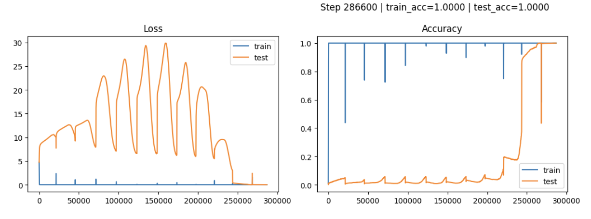

# Transformer Grokking Lab

Minimal experiment to observe **grokking-like behavior** in a tiny Transformer on modular arithmetic.

## What you’ll see
- Train accuracy reaches high values early.
- Test accuracy can stay low for long.
- After extended training, test accuracy may jump sharply.

## Files
- `grokking_live_notebook.ipynb` — primary notebook
- `grokking_live.py` — script version
- `EXPERIMENTATION.md` — design + rationale

## Live run snapshot

## Reference
Power et al., **Grokking: Generalization Beyond Overfitting on Small Algorithmic Datasets**  
https://arxiv.org/abs/2201.02177
